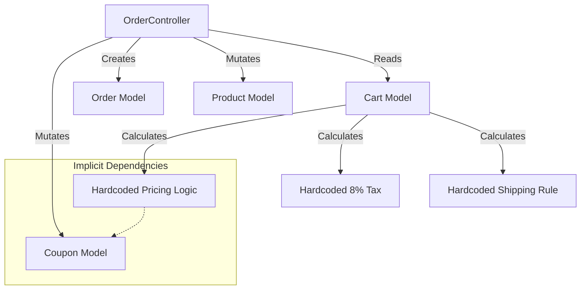

# Current Architecture & Gap Analysis

## 1. High-Level Overview

The current application is a **Laravel Monolith** following a standard MVC pattern but with heavy logic coupling in Active Record models and Controllers. It does not follow the "Modular Monolith" structure required by the target architecture.

### Key Characteristics:
- **Framework**: Laravel 10.x
- **Pattern**: MVC (Model-View-Controller)
- **API**: RESTful JSON API (`app/Http/Controllers/Api`)
- **Frontend**: React (SPA) consuming the API.

---

## 2. Domain Logic Map

### 🛒 Cart Engine
**Location**: `App\Models\Cart` (Fat Model)
- **State**: Database-backed (`carts` table) with Session ID fallback.
- **Logic**:
  - `getSubtotalAttribute`: Simple sum of items.
  - `getDiscountAttribute`: Hardcoded coupling to `Coupon` model.
  - `getShippingAttribute`: **Hardcoded Rule** (Free > $50, else $5.99).
  - `getTaxAttribute`: **Hardcoded Rule** (Flat 8%).
- **Violation**: Business rules (pricing, tax, shipping) are hardcoded in the entity class.

### 📦 Order Management
**Location**: `App\Http\Controllers\Api\OrderController::store` (Transaction Script)
- **Process**:
  1. Validates Request.
  2. Creates Addresses (Billing/Shipping).
  3. Creates `Order` record.
  4. Iterates Cart Items -> Creates `OrderItem` records.
  5. **Directly Decrements Stock** on `Product` model.
  6. **Directly Increments Usage** on `Coupon` model.
  7. Clears Cart.
- **Violation**:
  - No "Order Service" or "Place Order" action.
  - No atomic state machine.
  - Direct database mutation for inventory (no ledger).

### 🏷️ Pricing & Discounts
**Location**: `App\Models\Cart` & `App\Models\Coupon`
- **Logic**: Simple Percentage/Fixed amount logic.
- **Violation**:
  - No Rule Engine.
  - Rules are buried in `Cart::getDiscountAttribute`.
  - Cannot support complex conditions (e.g., "Buy X Get Y").

### 📦 Inventory
**Location**: Scattered (`OrderController`, `ProductController`)
- **Logic**: `decrement('stock_quantity')`.
- **Violation**:
  - No Inventory Ledger.
  - No reservation mechanism during checkout (Race conditions possible).
  - No audit trail for stock adjustments.

---

## 3. Structural Analysis (vs Target)

| Component | Current State | Target State | Gap Severity |
|-----------|---------------|--------------|--------------|
| **Architecture** | Standard MVC | Modular Monolith (`/core`) | 🔴 High |
| **Events** | None (Procedural) | Internal Event Bus | 🔴 High |
| **Cart** | Fat Model (`App\Models\Cart`) | `Core\Cart` Module | 🟠 Medium |
| **Orders** | Controller Script | `Core\Order` (State Machine) | 🔴 High |
| **Inventory** | Column Mutation | `Core\Inventory` (Ledger) | 🔴 High |
| **Pricing** | Hardcoded/Coupons | `Core\Pricing` (Rule Engine) | 🔴 High |

---

## 4. Dependency Graph

## 5. Migration Strategy
1.  **Stabilize**: Create `Core\Product` and `Core\Inventory` to wrap existing models.
2.  **Extract**: Move `OrderController` logic to `Core\Order\Actions\CreateOrder`.
3.  **Refactor**: Move `Cart` calculation logic to `Core\Pricing\Services\PricingService`.
